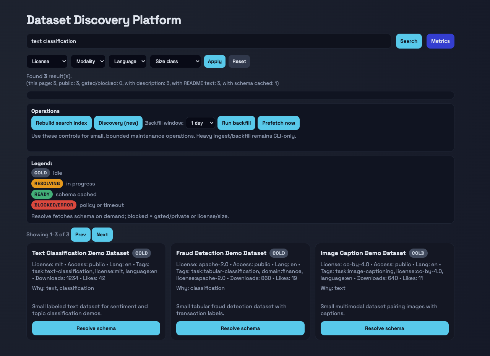
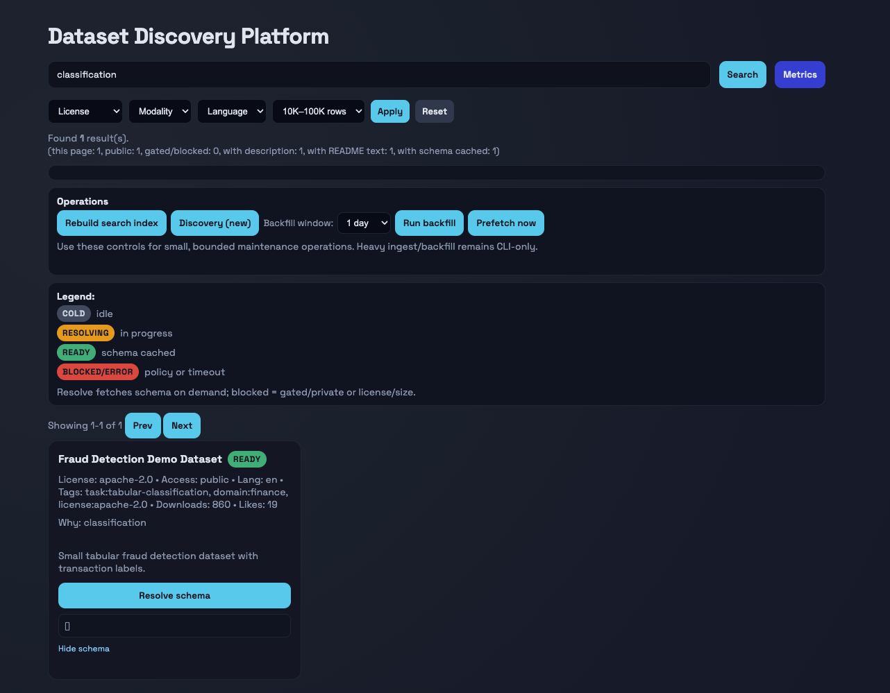

# Dataset Discovery Platform

Seeded-demo dataset discovery system with a DuckDB catalog, FastAPI backend, background worker, and static browser UI.

This public repository is the V2 demo surface only. The supported path is a local seeded demo that you can run from this checkout without relying on private infrastructure.

- Search and inspect a small dataset catalog backed by DuckDB.
- Exercise the same API and worker boundaries used by the broader V2 codebase.
- Reproduce the demo locally with root-level scripts, smoke tests, and CI.

## Why it matters

This project demonstrates practical MLE/DE systems work in a compact, reproducible form:

- local analytical storage instead of notebook-only exploration
- an HTTP API and background worker instead of a one-shot script
- explicit service boundaries for search, artifact retrieval, policy checks, and runtime metrics
- a seeded local path that is fast to run and honest about current scope

## What the system does

The supported product surface in this repo is a local dataset discovery demo:

- builds a DuckDB catalog from a seeded fixture
- serves search and artifact endpoints through FastAPI
- runs a lightweight worker for on-demand artifact resolution
- serves a static UI for search, filtering, metrics, and schema preview

An optional Hugging Face-backed sync path still exists in code, but it is not the supported public demo flow and is not required for local validation.

## Architecture / flow

1. `tests/fixtures/demo_catalog.json` seeds a local DuckDB file.
2. `V2/storage/duckdb_backend.py` stores datasets, artifacts, jobs, and search state.
3. `V2/api/main.py` starts the FastAPI app, CORS layer, and background worker.
4. `V2/api/routes.py` exposes `/v2/healthz`, `/v2/search_index`, `/v2/get_artifact`, `/v2/request_resolve`, and `/v2/admin`.
5. `V2/ui/index.html` calls the API and renders the seeded discovery experience in the browser.

## Tech stack

- Python 3.12
- DuckDB
- FastAPI
- Uvicorn
- Pydantic
- `http.server` via a small wrapper script for the UI
- Pytest
- GitHub Actions CI

## Quickstart

Create a local virtual environment and install the root dependencies:

```bash
python3 -m venv .venv
./.venv/bin/pip install -r requirements.txt
```

Build the seeded local demo database:

```bash
./.venv/bin/python -m scripts.create_demo_db --db-path data/demo_discovery.duckdb
```

Start the API:

```bash
DUCKDB_PATH=data/demo_discovery.duckdb ./.venv/bin/python -m scripts.run_api --host 127.0.0.1 --port 8000
```

Start the UI in a second terminal:

```bash
./.venv/bin/python -m scripts.serve_ui --host 127.0.0.1 --port 8080
```

Open:

- API health: `http://127.0.0.1:8000/v2/healthz`
- UI: `http://127.0.0.1:8080`

## Demo flow

Use the seeded UI or call the API directly with realistic demo queries such as:

- `text classification`
- `fraud`
- `image`

Expected behavior:

- search results come from the seeded DuckDB catalog
- the text-classification record already has a seeded schema artifact
- `request_resolve` returns a cached response for that seeded schema
- size, modality, language, and license metadata are returned through the API for UI filtering

## Smoke tests / CI

Run the smoke suite from the repo root:

```bash
./scripts/run_smoke_tests.sh
```

Current smoke coverage:

- app startup
- `GET /v2/healthz`
- `POST /v2/search_index`
- `GET /v2/admin`
- `GET /v2/get_artifact`
- cached `POST /v2/request_resolve`

CI runs the same repo-root flow in GitHub Actions:

1. create a virtual environment
2. install `requirements.txt`
3. build the seeded demo database
4. run the smoke tests

## Results / screenshots

The screenshots below come from the supported seeded local demo path described in this README.



Text-classification search over the seeded demo catalog.


Fraud dataset detail with the seeded schema view opened.



Filtered seeded search using the size-class control.

## Repo structure

```text
.
├── .github/workflows/ci.yml
├── README.md
├── assets/
├── requirements.txt
├── scripts/
├── tests/
├── data/
└── V2/
```

Key areas:

- `V2/`: application code for storage, API, worker, optional connectors, and the UI
- `assets/screenshots/`: seeded-demo UI screenshots used in this public README
- `scripts/`: repo-root commands for demo DB creation, API run, UI serve, and smoke tests
- `tests/`: smoke coverage and seeded fixture data
- `.github/workflows/ci.yml`: public CI for the seeded demo path

## Tradeoffs / limitations

- The supported path is a seeded local demo, not a full reproduction of the live ingestion workflow.
- Browser-level UI automation is not included in this repo.
- On the validated setup used for this public polish pass, DuckDB full-text index creation fell back to the repo's LIKE-based matcher.
- Some optional admin and external-sync operations target broader runtime workflows and were not part of the supported seeded demo validation.
- The codebase still contains a few framework deprecation warnings that do not block the demo path.

## Future improvements

- add browser-based UI smoke coverage for the seeded local path
- replace deprecated FastAPI lifecycle hooks and naive UTC timestamps
- package the local demo flow into a single helper command
- expand the optional external sync path only after the public demo remains reproducible
